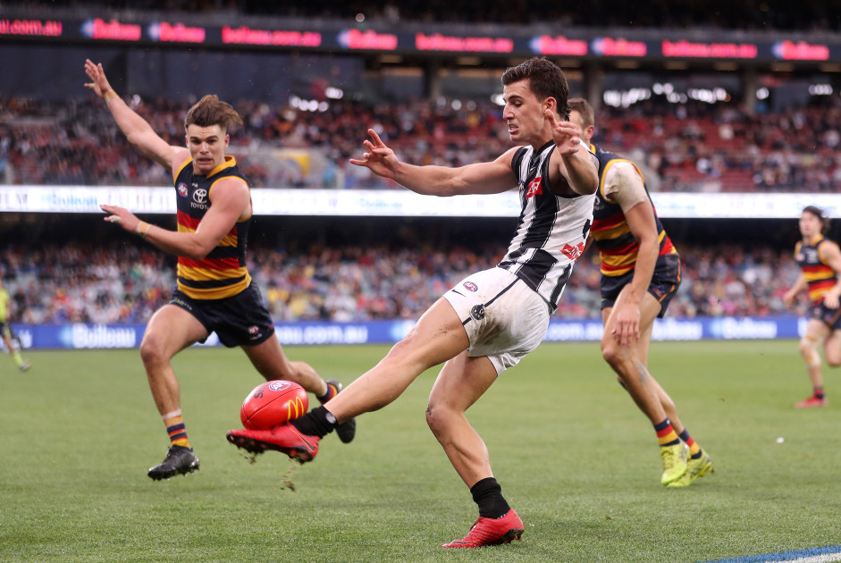
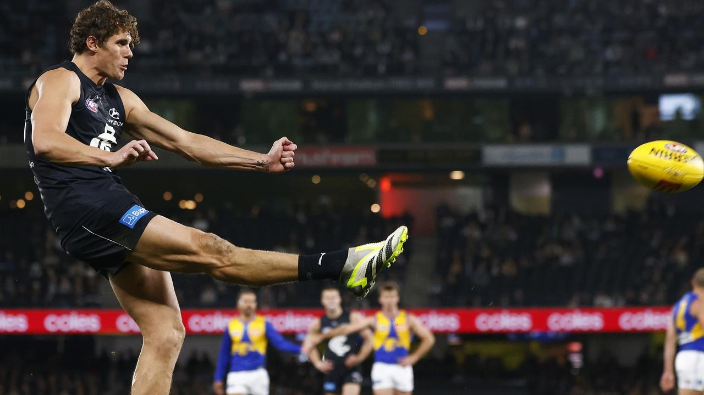

```{r setUp, message=FALSE, warning=FALSE, include=FALSE}
library(tidyverse)
library(rmarkdown)
library(reactable)
```

:::: {style="display: flex;"}

::: {.column width="55%"}
SuperCoach AFL is a very popular fantasy sports game in Australia. Footy fans become the 'coach' of a fantasy team, where each player is scored each match based on their game performance. It has just opened to the public for 2024 and avid punters can now put together their starting squad.

The main premise of SuperCoach, and its scoring system in particular, is that every action in a game of Australian Football has an impact on the result of the match. Some actions are more important than others. Players can determine a game in a shot for goal, or save their lead in a massive pack-mark on the goal line. In essence, each statistic is scored on how much it improves the chances of winning.

However, this scoring system is kept secret - we essentially have to believe what each player scores is legitimate. There is no definitive list of which stats are included, or how collated stats get broken down, leaving the community to guess what is going on. My offseason project is to figure out which stats matter, what they're all worth, and create advanced player stats. Let's go!
:::

::: {.column width="45%"}

:::

::::

# Where do we start?

I've spent the offseason researching the game of SuperCoach and which stats might be included in the scoring system. This includes browsing X (Twitter), online AFL forums, <a href= "https://www.championdata.com/glossary/afl/">the Champion Data glossary</a>, but as a student I didn't wanna pay up for a Herald Sun subscription. It probably would've been wise in hindsight...

At the heart of the ranking points system is that it considers players winning the ball, disposing of it, and where on the ground they do it. It seems that we only need to focus on the things a player does with the ball, plus a few of the simpler defensive actions.

Last year, I attempted this same feat by applying "known" values to each match. For example, we've heard that goals are worth 8 points. While this is more useful than nothing, SuperCoach has deeper intricacies to its scoring system. Unlike other fantasy games, ranking points are weighted and adjusted by the time-elapsed in a match and the current margin. This means that scoring in close games looks a lot different to scoring in a blowout. A goal could be 10 points or 5; it always changes.

We also know that events that happen in **D50 or F50** are **worth ~20% more** compared to the midfield. You are rewarded more for perfoming acts in scoring zones. Finally, SuperCoach also stick to the '3300 rule' - a match scaling rule that ensures every game finishes with the same amount of points.

After review of last year's analysis, which had good (but unusable) results, I decided that I need to get fancier. I needed more match statistics than ever before, and it seemed there was enough variety across AFL stats sources - the AFL website, the AFL app, Champion Data, and other match centres.

With my research in mind, I came up with a plan of action:

1. Collect, calculate and collate as many statistics as possible

2. Determine the zone in which each stat occurred (D50, MID, F50) for more precision

3. Create a model to weight all the stats with respect to each player's final score

4. Remove statistics that are insignificant or better described in more detail

5. Add scaling to the 3300 figure for each match

6. Summarise the results and present the **average** value each stat is worth

# Sourcing the advanced stats

:::: {style="display: flex;"}

::: {.column width="55%"}
You might be familiar with the possibilities of Stats Pro in the AFL app. On mobile, you can watch player highlights in short clips of their involvements for the match.

The best thing about this feature is that every stat is time-stamped. I first started by downloading every player's set of actions from each match, and then combined them all in chronological order. This means we can view each game from an individual stat perspective, and we can get an idea of how the ball moves.

This has changed how I work with statistics for the fantasy platforms, as I am now assessing player performance via when they win the ball, the state in which they get involved (stoppages, turnover, etc) and where on the ground they are. The last point is the key - we know that SuperCoach points are likely to be boosted when in defensive-50 or forward-50.
:::

::: {.column width="45%"}

:::

::::
We can combine these new stats with what we already have from the AFL website and other stats providers to *hopefully* give us everything we need for an accurate model.

# The model

I've been collecting data from these sources, but unfortunately a lot of it has been manual interpretation. This includes calculating kick distances, kick direction, kick effectiveness, how the kick was received, who generated score assists, whether each mark was from a teammate or opponent, the result of spoils, kick-in playing on vs taking it from the square, the result of hitouts... it was a complicated task. Oh, and grouping every stat by D50, MID or F50 zones! It was certainly an entire-offseason project.

With all stats collected, we should be able to calculate an **average** points value for each stat across all game scenarios - close or a blowout. As every game is worth the same approximate 3300 points, the scaling should be similar across all games too. What this means is that we can estimate what our players typically get rewarded for a specific act on the footy field.

To find an average value for each statistic, I've decided to go with a simple linear model where we try to minimise deviation from the real score. My results yielded a **R-squared value of 0.968**, meaning that 96.8% of variation in SuperCoach scoring is explained by this model. I think that's pretty good considering we aren't scaling stats based on the margin or how much of the game has elapsed! The **mean absolute error (MAE)** for each SuperCoach score was **4.23**, meaning that on average, this model was only 4.23 points off the real SuperCoach score for each player.

This is a *significant* improvement from the last time <a href="https://jaidenpopowski.github.io/StatsByJaiden/">I tried to figure out SuperCoach scoring</a>, which had results of 90.2% R-squared and 7.81 MAE, and had a lot of scaling issues.

# Statistics Breakdown

### Possession

:::: {style="display: flex;"}

::: {.column width="55%"}
**Loose ball-get** - Picking up the ball at ground level without pressure

**Hard ball-get** - Picking up the ball at ground level under pressure

**Loose crumb** - Collecting the ball without pressure that comes to ground via marking contest

**Hard crumb** - Collecting the ball with pressure that comes to ground via marking contest

**Gather** - Receiving the ball from a teammate

**Gather from opposition** - Receiving the ball from opposition turnover

**Gather from hitout** - Receiving the ball from a hitout to advantage

**Handball Receive** - Receiving the ball from a teammate's handball

**Free For** - Receiving a free kick from an opponent's error
:::

::: {.column width="45%"}

:::

::::

```{r, echo=FALSE}
data.frame(
  Stat = c("Loose Ball Get","Hard Ball Get","Loose Ball Get - Crumb","Hard Ball Get - Crumb","Gather","Gather from Opposition","Gather from Hitout","Handball Receive","Free For"),
  MID = c(3.4,3.3,3.2,3.1,1.1,2.4,1.4,1.0,3.1),
  D50 = c(4.0,3.9,3.9,3.6,1.3,3.0,1.9,1.2,3.9),
  F50 = c(4.0,3.8,3.8,3.8,1.1,2.5,1.7,1.2,3.8)
) %>% 
  reactable::reactable(
    elementId = "supercoach-possession",
    columns = list(
      Stat = colDef(minWidth = 40),
      MID = colDef(minWidth = 20,format = colFormat(digits = 1)),
      D50 = colDef(minWidth = 20,format = colFormat(digits = 1)),
      F50 = colDef(minWidth = 20,format = colFormat(digits = 1))
    )
  )
```

### Disposal

:::: {style="display: flex;"}

::: {.column width="55%"}
**Effective Handball** - Handballing to your teammate effectively

**Effective Kick: Short** - A short kick that hits the target

**Effective Kick: Long** - A 40+ metre kick that reaches a contest

**Effective Kick: Long to Advantage** - A 40+ metre kick where a teammate receives the ball uncontested

**Effective Kick: Backwards** - A backwards kick that hits the target. Backward kicks inside 50 are scored as normal kicks

**Ineffective kick/handball** - Disposals that don't reach the intended target

**Clanger Handball** - Handballs that directly result in opposition possession

**Clanger Kick** - Kicks that directly result in an opposition possession

**Clanger Kick: Backwards** - A backwards kick that results in opposition possession

:::

::: {.column width="45%"}

:::

::::

```{r, echo=FALSE}
data.frame(
  Stat = c("Effective Handball","Effective Kick Short","Effective Kick Long","Effective Kick Long to Advantage","Effective Kick Backwards","Ineffective Kick/Handball","Clanger Handball","Clanger Kick","Clanger Kick Backwards"),
  MID = c(1.0,2.9,3.0,3.6,0.7,0,-2.7,-2.7,-2.6),
  D50 = c(1.1,3.2,3.5,4.5,0.6,0,-3.5,-3.2,-3.0),
  F50 = c(1.1,3.2,3.5,4.9,NA,0,-3.3,-3.0,-3.1)
) %>% 
  reactable::reactable(
    elementId = "supercoach-disposal",
    columns = list(
      Stat = colDef(minWidth = 40),
      MID = colDef(minWidth = 20,format = colFormat(digits = 1)),
      D50 = colDef(minWidth = 20,format = colFormat(digits = 1)),
      F50 = colDef(minWidth = 20,format = colFormat(digits = 1))
    )
  )
```

### Kick-Ins

:::: {style="display: flex;"}

::: {.column width="55%"}
**Kick-In: Play-On** - Run the ball out of the square. The kick is scored by disposal values above

**Kick-In: Short** - Kicking the ball short to a teammate (from the square)

**Kick-In: Long** - Kicking the ball 40m+ (from the square)

**Kick-In: Clanger** - Kicking the ball out on the full or to the opposition (from the square)
:::

::: {.column width="45%"}


:::

::::

```{r, echo=FALSE}
data.frame(
  Stat = c("Kick-In Play-On","Kick-In Short","Kick-In Long","Kick-In Clanger"),
  Value = c(0.25,1.00,2.75,-3.15)
) %>% 
  reactable::reactable(
    elementId = "supercoach-kickins",
    columns = list(
      Stat = colDef(minWidth = 40),
      Value = colDef(minWidth = 20,format = colFormat(digits = 2))
    )
  )
```

### Marks

:::: {style="display: flex;"}

::: {.column width="55%"}
**Contested Mark** - Marking the ball under physical pressure

**Uncontested Mark** - Marking the ball without physical pressure

**Lead Mark** - Marking the ball on a lead from a teammate's kick

**Intercept Mark** - Marking the ball from an opponent's kick; can be contested or uncontested

:::

::: {.column width="45%"}

:::

::::

```{r, echo=FALSE}
data.frame(
  Stat = c("Contested Mark","Uncontested Mark","Lead Mark","Intercept Mark: Contested","Intercept Mark: Uncontested"),
  MID = c(4.1,1.4,3.3,5.8,3.0),
  D50 = c(5.0,1.7,3.8,7.2,3.8),
  F50 = c(5.3,1.7,4.3,9.0,3.3)
) %>% 
  reactable::reactable(
    elementId = "supercoach-marks",
    columns = list(
      Stat = colDef(minWidth = 40),
      MID = colDef(minWidth = 20,format = colFormat(digits = 1)),
      D50 = colDef(minWidth = 20,format = colFormat(digits = 1)),
      F50 = colDef(minWidth = 20,format = colFormat(digits = 1))
    )
  )
```

### Scoring

:::: {style="display: flex;"}

::: {.column width="55%"}
**Goal** - Scoring a goal

**Behind** - Scoring a behind

**Goal Assist** - Getting the ball to a teammate who scores a goal

**Behind Assist** - Getting the ball to a teammate who scores a behind
:::

::: {.column width="45%"}

:::

::::

```{r, echo=FALSE}
data.frame(
  Stat = c("Goal","Behind","Goal Assist","Behind Assist"),
  Value = c(7.4,0.9,3.2,3.5)
) %>% 
  reactable::reactable(
    elementId = "supercoach-score-types",
    columns = list(
      Stat = colDef(minWidth = 40),
      Value = colDef(minWidth = 20,format = colFormat(digits = 1))
    )
  )
```


### Defence

:::: {style="display: flex;"}

::: {.column width="55%"}
**Tackle** - Physically preventing an opponent from effectively disposing of the ball

**Spoil: Effective** - Spoiling the ball away from an opponent, resulting in teammate possession

**Spoil: Neutral** - Spoiling the ball away from an opponent, and ending the play by causing a stoppage

**Spoil: Ineffective** - Spoiling the ball away from an opponent, resulting in opposition possession

**Spoil: Gain Possession** - Spoiling the ball away from an opponent and winning the next possession. Possession scored separately
:::

::: {.column width="45%"}

:::

::::

```{r, echo=FALSE}
data.frame(
  Stat = c("Tackle","Spoil: Effective","Spoil: Neutral","Spoil: Ineffective","Spoil: Gain Possession"),
  MID = c(2.9,2.1,2.0,0.9,2.0),
  D50 = c(3.4,1.6,2.6,0.9,1.8),
  F50 = c(3.4,2.4,1.4,1.6,2.4)
) %>% 
  reactable::reactable(
    elementId = "supercoach-defence",
    columns = list(
      Stat = colDef(minWidth = 40),
      MID = colDef(minWidth = 20,format = colFormat(digits = 1)),
      D50 = colDef(minWidth = 20,format = colFormat(digits = 1)),
      F50 = colDef(minWidth = 20,format = colFormat(digits = 1))
    )
  )
```

### Ruck Contests

:::: {style="display: flex;"}

::: {.column width="55%"}

**Hitout to Advantage** - Tapping the ball directly to a teammate

**Hitout to Opposition** - Hitouts where the next possession is won by an opponent. Calculated manually, this is twice as accurate as using plain hitouts, but not as good as 'sharked hitouts'. It's as close as I can get, and they're around twice as common as sharked hitout numbers.

**Ruck Hard Ball Get** - Grabbing the ball out of the ruck instead of tapping it (contested possession)
:::

::: {.column width="45%"}

:::

::::

```{r, echo=FALSE}
data.frame(
  Stat = c("Hitout to Advantage","Hitout to Opposition","Ruck Hard Ball Get"),
  MID = c(3.5,-0.5,3.4),
  D50 = c(4.2,-0.7,3.7),
  F50 = c(4.3,-0.6,4.1)
) %>% 
  reactable::reactable(
    elementId = "supercoach-ruck-contests",
    columns = list(
      Stat = colDef(minWidth = 40),
      MID = colDef(minWidth = 20,format = colFormat(digits = 1)),
      D50 = colDef(minWidth = 20,format = colFormat(digits = 1)),
      F50 = colDef(minWidth = 20,format = colFormat(digits = 1))
    )
  )
```

### One Percenters

:::: {style="display: flex;"}

::: {.column width="55%"}
One percenter totals also include spoils.

**Contested knock-on** - Tapping the ball (under pressure) to a teammate

**Knock-on** - Tapping the ball to a teammate

**Smother** - Preventing an opponent's disposal by deflecting the motion of the ball

**Shepherd** - Protecting a teammate in possession by physically getting in the way of an opponent

**Block** - Protecting a teammate marking the ball by physically preventing an opponent from contesting it. Illegal in the rules, yet still recorded (yes... Willie Rioli was officially rewarded a block stat for preventing Maynard reaching Dom Sheed)

**Touched** - Touching the ball on the line preventing it from going through as a goal, causing a touched behind

**Running bounce** - Bouncing the ball while in possession (not a one-percenter but I had to put it somewhere!)
:::

::: {.column width="45%"}

:::

::::
```{r, echo=FALSE}
data.frame(
  Stat = c("Contested Knock-On","Knock-On","Smother","Shepherd","Block","Touched","Running Bounce"),
  MID = c(4.0,2.4,1.9,1.2,1.0,NA,1.4),
  D50 = c(4.6,1.7,2.3,1.3,2.2,3.1,1.5),
  F50 = c(4.8,2.5,1.9,1.9,2.0,NA,3.5)
) %>% 
  reactable::reactable(
    elementId = "supercoach-onepercenters",
    columns = list(
      Stat = colDef(minWidth = 40),
      MID = colDef(minWidth = 20,format = colFormat(digits = 1)),
      D50 = colDef(minWidth = 20,format = colFormat(digits = 1)),
      F50 = colDef(minWidth = 20,format = colFormat(digits = 1))
    )
  )
```

### Clangers

:::: {style="display: flex;"}

::: {.column width="55%"}
Clanger kicks, clanger handballs and clanger kick-ins are also included in clangers totals.

**Free Against** - Conceding a free kick to the opposition via an error

**50m Penalty** - Conceding a more severe or secondary free kick that advances the opposition 50m forward. I couldn't reverse engineer D50/F50 splits for these

**Dropped Mark** - Dropping an uncontested mark

**Dropped Mark (Gain)** - Dropping an uncontested mark but picking it up uncontested. Counted as a clanger if it's inside F50 which is why it is equivalent to normal dropped marks. The gain itself is scored as a possession

**Debit** - Ruining a teammate's chance at an uncontested mark by going for the mark too

**No Pressure Error** - Dropping the ball and losing possession under no pressure
:::

::: {.column width="45%"}

:::

::::

```{r, echo=FALSE}
data.frame(
  Stat = c("Free Against","50m Penalty Against","Dropped Mark","Dropped Mark (Gain)","Debit","No Pressure Error"),
  MID = c(-2.8,-6.3,-2.9,-1.3,-1.3,-2.6),
  D50 = c(-3.2, NA, -3.0,-5.6,-2.4,-3.7),
  F50 = c(-3.1, NA, -3.7,-3.6,-2.4,-3.4)
) %>% 
  reactable::reactable(
    elementId = "supercoach-clangers",
    columns = list(
      Stat = colDef(minWidth = 40),
      MID = colDef(minWidth = 20,format = colFormat(digits = 1)),
      D50 = colDef(minWidth = 20,format = colFormat(digits = 1)),
      F50 = colDef(minWidth = 20,format = colFormat(digits = 1))
    )
  )
```

### What's not included?

Many common stats used in the AFL landscape are not actually included in the all-encompassing SuperCoach formula. Typically these stats are better broken down by stats already mentioned. For example, most clearances have both a possession and a disposal that comprise a clearance. I'm confident that these stats aren't included based on their lack of statistical significance on the model:

* Clearances (better scored as possession + disposal)
* Inside-50s (disposal + potential score/assist)
* Metres Gained (long kicks bonus)
* Hitouts (0)
* Ineffective Kicks/Handballs (0)
* Score Launches (usually involves an intercept)
* Score Involvements (only the assist player or scorer)
* Pressure Acts
* Turnovers (40m+ long kicks can be effective yet still turn the ball over)
* 1-on-1 marking contest wins/losses (Contested Mark)
* Intercepts (either intercept mark or a gather from opposition)

### Conclusion

I hope you have gained some clarity on the facets that are important for scoring in SuperCoach AFL. It's been a long process and *many* hours browsing Twitter, BigFooty and using the fancy exploits of Google Search to gain info from paywalled articles. Ultimately, we won't ever get all the pieces due to intellectual property policies, but I really wanted to understand where players excel.

The benefit of this analysis is that unlike ever before, we can look at how players score their points. Each game's stats are now calculated for all players and we can answer complex questions with ease. Which player had the most effective handballs inside 50? Which player gains the most points from kicking it long? Who are the best spoilers in the game?

These questions are just the beginning. I look forward to looking into specific stats as preseason 2024 continues. To make sure you don't miss out you can <a href="twitter.com/jaiden_popowski">Follow me on Twitter/X</a> and <a href="instagram.com">follow me on Instagram</a>. I'm always open to your questions so tag me in a post, I'd love to answer!

Thanks for reading! Your support ensures I can continue to create content like this.

<iframe id='kofiframe' src='https://ko-fi.com/statsbyjaiden/?hidefeed=true&widget=true&embed=true&preview=true' style='border:none;width:90%;padding:4px;background:#f9f9f9;' height='712' title='statsbyjaiden'></iframe>